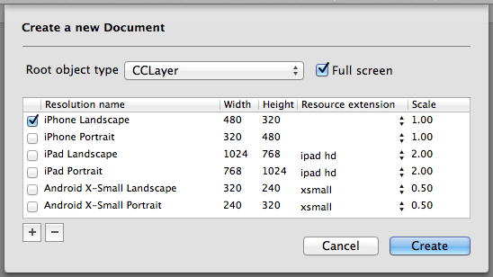

# Setting up a New Project
This section will guide you through the process of setting up a new project with CocosBuilder. It assumes that you already are familiar with cocos2d-iphone. If you haven't used it before, download it from [cocos2d-iphone.org](http://cocos2d-iphone.org) and have a look at some of the tutorials over there.

## Creating a Project
It's best to setup your Xcode project before creating your CocosBuilder project. Make sure that the cocos2d templates are installed and create a new cocos2d-iphone project in Xcode (if you do not already have a project you want to use with CocosBuilder).

Once you have the Xcode project set up, create your CocosBuilder project. Select *New Project…* from the *File* menu. Save the CocosBuilder project in the Xcode project's *Resources* directory.

All images and sprite sheets you put in the *Resources* directory will now show up automatically in CocosBuilder's project view on the left side of the main window, but remember that you will need to add them to your Xcode project if you want to use them in the compiled version of your app.

## Adding Interface Files
CocosBuilder uses interface files, or *ccb-files*, to define cocos2d node graphs which you load from your code. To create a new ccb-file, select *New File…* from the *File* menu. You will be presented with a dialog where you can select the class of the root node of your node graph and which resolutions the file should support.

## Publishing Your Project
Before you can import the files you create in CocosBuilder in your code you will need to publish them. To publish all ccb-files in a project, select *Publish* in the *File* menu. For each ccb-file a new *ccbi-file* is created. The ccbi files are very compact binary files with all unnecessary information stripped out. Include the ccbi-files in your Xcode project.

To load a ccbi-file from your code, make sure that you have included the CCBReader classes  in your Xcode project. Then call the CCBReader's *nodeGraphFromFile* method.

    CCNode* myNodeGraph = [CCBReader nodeGraphFromFile:@"myFile.ccbi"];

## Project Settings
By default CocosBuilder will export your ccb-files to the same direcory as the project file, but you can change in which directories CocosBuilder should look for resources and to where ccb-files should be exported. It is also possible to export ccb-files together with your images to a zip-file.

Access the project settings by selecting *Project Settings…* from the *File* menu.

