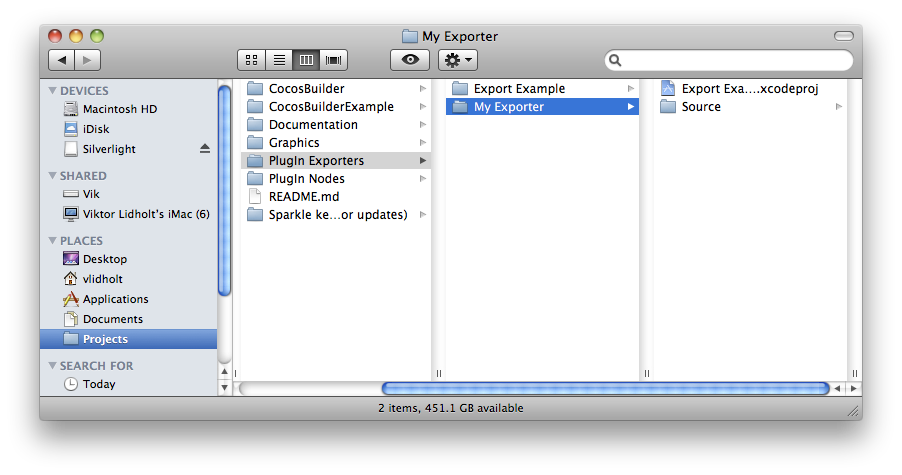
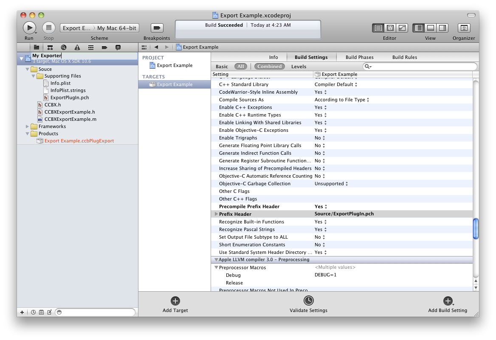
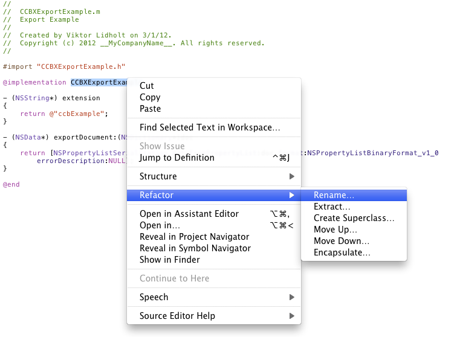

# CocosBuilder - Create export plug-in

CocosBuilder has support for creating custom export plug-ins. Bundled with CocosBuilder comes the default ccbi-exporter, but it is easy to add new output formats.

## Setup a new plug-in project

The easiest way to setup a new plug-in project is to duplicate and rename the example plug-in. Open the _PlugIn Exporters_ folder and duplicate the _Export Example_ folder. Rename it to what you want your new export plug-in to be called.

Now open the Xcode project in the new folder. Rename the project by clicking _slowly_ twice on the projects name. The name you use here is what will be displayed in the save dialog when selecting _Publish As…_ in CocosBuilder.

You will now be asked to rename various project content items. Keep everything selected and click the _Rename_ button.

The plug-in uses a custom class to export your CocosBuilder document. This class's name needs to be unique for each plug-in. Therefore, you will need to rename the plug-in's main class. This is easiest done by opening the file, right clicking on the class's name and selecting _Refactor_ -> _Rename_.

Enter a name that corresponds to your plug-in's name and use the _CCBX_ prefix. You will also need to open the Info.plist file and change the _Principal class_ property to the name of your new class.

To compile the plug-in, hit the _Run_ button i Xcode. You can locate the compiled plug in by right clicking it in _Products_ and selecting _Show in Finder_.

To test the plug-in you will need to copy it into CocosBuilder's _PlugIns_ folder. In the Finder, right click CocosBuilder and select _Show Package Contents_. In the folder _Contents/PlugIns_ you can find all installed plug-ins.

## Write the plug-in

The export plug-in is very simple in it's structure. It's main class should contain two methods that CocosBuilder will call. The first method, _extension_, simply returns a string with the extension that the exported file should use. For instance, this is what the default ccbi exporter uses.

    - (NSString*) extension
    {
        return @"ccbi";
    }
    
The second method, _exportDocument:_ is where all the magic of the exporter happens. It will receive a NSDictionary that contains the complete document. The document structure can be found in the _CCB File Format_. The _exportDocument:_ should create and return an autoreleased NSData object with the contents of the file to export. The example file uses NSPropertyListSerialization to create a plist representation of the document (same as ccb file save).

    - (NSData*) exportDocument:(NSDictionary*)doc
    {
        return [NSPropertyListSerialization dataFromPropertyList:doc format:NSPropertyListBinaryFormat_v1_0 errorDescription:NULL];
    }