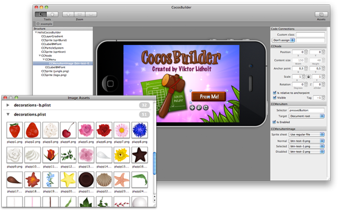

# CocosBuilder

CocosBuilder is a free tool (released under MIT-licence) for graphically laying out sprites, layers and scenes for Cocos2D iPhone and Mac. It’s ideal for quickly and accurately creating menus and other parts of the interface, but can also be used to create levels, particle systems or any other kind of Cocos2D node graphs.

It’s super easy to include the scenes you build in CocosBuilder into your project. Add the CCBReader files, then load the node graph or scene with a single line of code!

CocosBuilder allows you to patch into the generated file at any point by automatically assigning variables and custom classes for the objects that you load through the CCBReader. Objects created by CocosBuilder also plays beautifully with your existing Cocos2D code.

## Example usages

Load a CCScene from a CocosBuilder project:

    CCScene* scene = [CCBReader sceneWithNodeGraphFromFile:@"example.ccb"];

Load a particle system (the root node of the ccb-file needs to be a CCParticleSystem):

    CCParticleSystem* particles = (CCParticleSystem*)
        [CCBReader nodeGraphFromFile:@"example-particles.ccb"];

## Known issues

CocosBuilder has not been tested on Lion